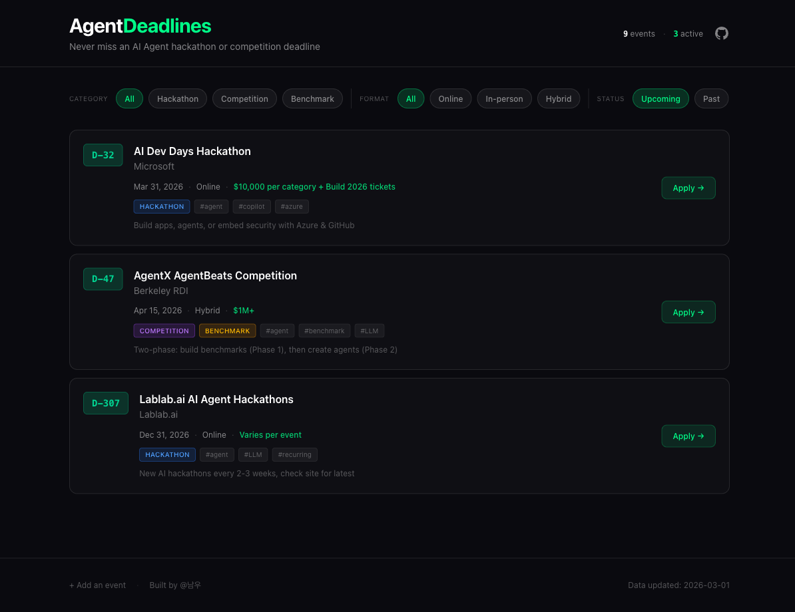

<p align="center">
  <h1 align="center">Agent<span>Deadlines</span></h1>
  <p align="center">
    Never miss an AI Agent hackathon or competition deadline.
    <br />
    <a href="https://agentdeadlines.vercel.app"><strong>View Live Site</strong></a>
    &nbsp;&middot;&nbsp;
    <a href="#add-an-event">Add an Event</a>
    &nbsp;&middot;&nbsp;
    <a href="https://github.com/SEED-TO-TREE/agentdeadlines/issues">Report Bug</a>
  </p>
</p>

<br />

<p align="center">
  
</p>

<br />

## About

**AgentDeadlines** is a community-driven deadline tracker for AI Agent hackathons, competitions, and benchmark challenges. Inspired by [aideadlin.es](https://aideadlin.es), rebuilt with a modern stack.

### Features

- **Countdown badges** — Color-coded urgency (red/orange/green) with live updates
- **Smart filters** — Filter by category (Hackathon / Competition / Benchmark), format (Online / In-person / Hybrid), and status (Upcoming / Past)
- **Dark theme** — Cyberpunk-inspired UI with neon accents
- **Responsive** — Works on desktop, tablet, and mobile
- **Community data** — Events managed via YAML, open for PRs

## Tech Stack

| | |
|---|---|
| **Framework** | Next.js 14 (App Router) |
| **Styling** | Tailwind CSS 4 |
| **Language** | TypeScript |
| **Data** | YAML |
| **Package Manager** | pnpm |
| **Deployment** | Vercel |

## Getting Started

```bash
# Clone the repo
git clone https://github.com/SEED-TO-TREE/agentdeadlines.git
cd agentdeadlines

# Install dependencies
pnpm install

# Run dev server
pnpm dev
```

Open [http://localhost:3000](http://localhost:3000) in your browser.

## Add an Event

We welcome community contributions! To add a new event:

1. Fork this repository
2. Add your event to `data/events.yaml`
3. Submit a Pull Request

See [CONTRIBUTING.md](CONTRIBUTING.md) for the full guide and YAML schema.

## License

[MIT](LICENSE) — Built by [@남우](https://github.com/SEED-TO-TREE)
